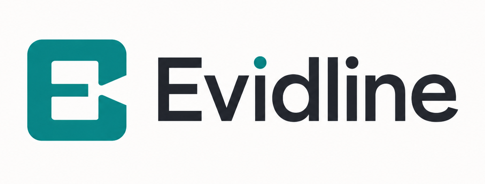
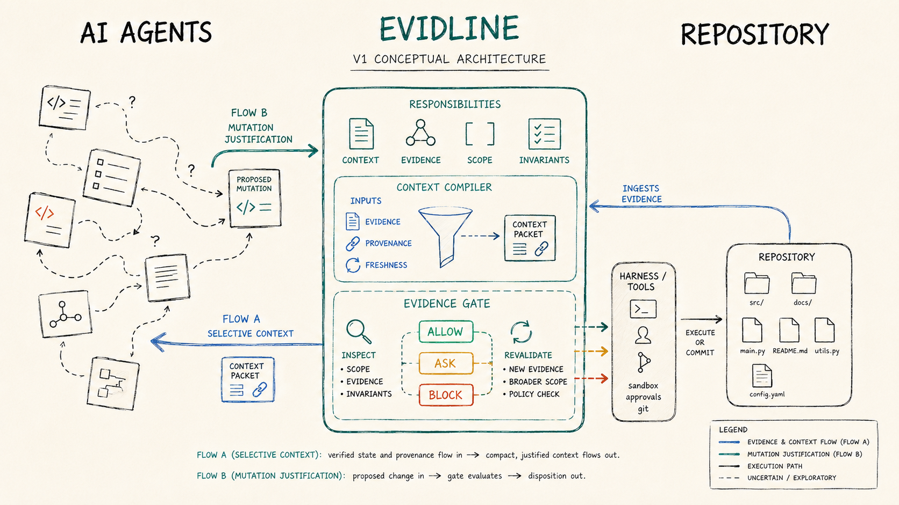
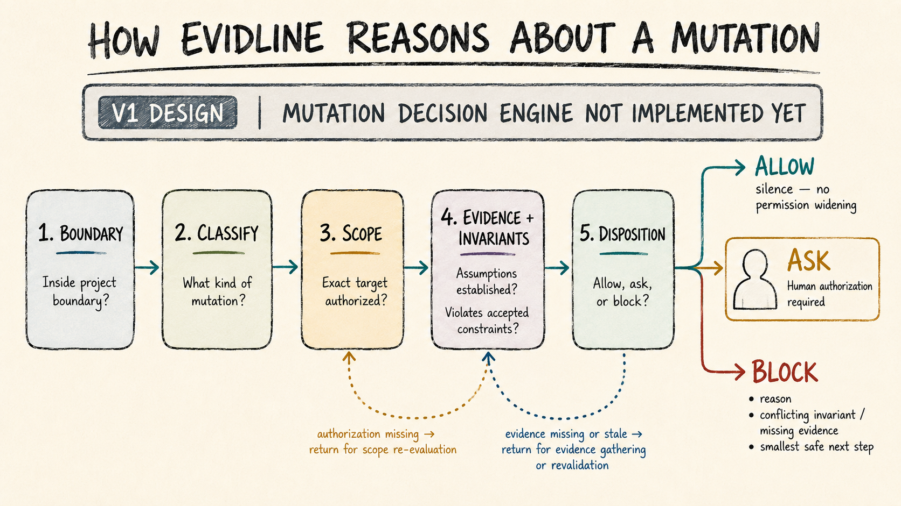
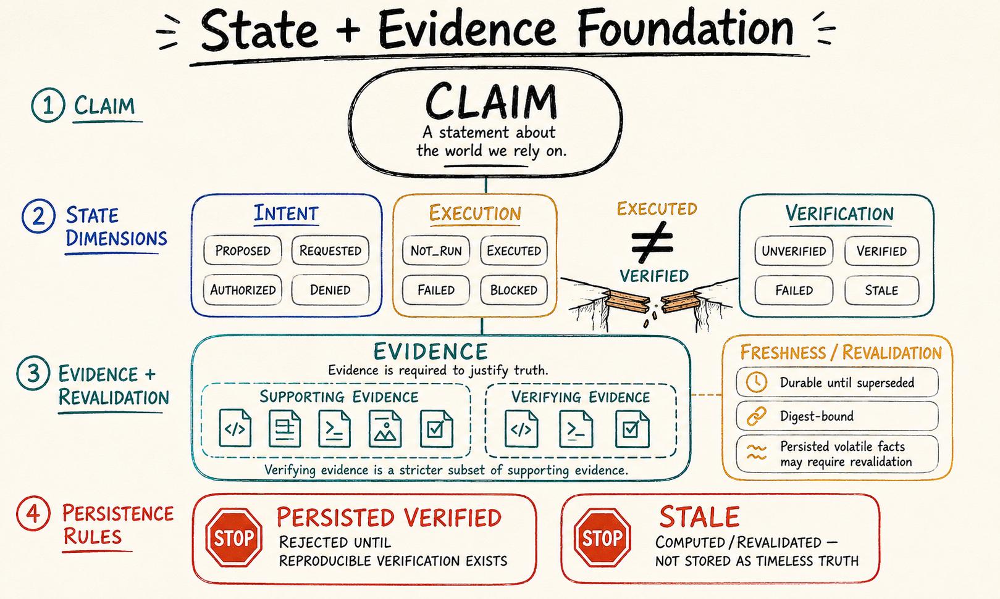

<p align="center">
  
</p>

<p align="center">
  
  
  
  
</p>

<p align="center"><em>Evidline is a local-first tool for AI coding agents. It is designed to keep project context and evidence with clear source information, and to check proposed project changes against scope, evidence, freshness, and project rules.</em></p>

## What Evidline is

AI coding agents do the work, and the repository holds the project. Evidline is designed to show an agent which project information matters for the current task, so a fresh session does not need to relearn everything from scratch.

The coding harness still controls whether a tool can actually run. Evidline adds to sandboxing, approval systems, Git review, operating system protection, and human review, but it does not replace any of them.

## Why Evidline exists

Fresh AI agent sessions lose the verified knowledge that earlier sessions built up, and old chat or remembered context can go stale. A claim is not automatically a fact, and technical permission to run a tool is not the same as project authorization to change the repository. Evidline is being designed so unsupported changes do not silently become accepted project state.

## Conceptual architecture

This image shows the V1 conceptual architecture. It explains how AI agents, Evidline, context, evidence, scope, invariants, harness tools, and the repository are meant to relate. It is a design view, not a screenshot of running software.

<p align="center">
  
</p>

The design has two main ideas. First, Evidline gives an agent only the project context that is useful for the current task. Second, Evidline checks whether a proposed project change has enough support from scope, evidence, freshness, and project rules.

Actual tool execution still belongs to the coding harness. Evidline is not a firewall, and it does not take over sandboxing, approval systems, Git review, operating system protection, or human review.

## Core ideas

| Concept | Meaning |
| --- | --- |
| Permission | Can the harness run the tool? |
| Authorization | Did the human or the project allow this kind of change? |
| Evidence | Are the facts behind a claim established? |
| Execution | Did the action actually run? |
| Verification | Has the result been checked independently? |

`EXECUTED` does not mean `VERIFIED`.

Fresh evidence gathered from the repository right now is worth more than remembered or stored state.

## Mutation reasoning

When an agent proposes a change, Evidline is designed to check whether the change is supported before it is accepted. The image below shows the five checks in order.

<p align="center">
  
</p>

The five checks:

- **Boundary**: is the target inside the project?
- **Classify**: what kind of change is being proposed?
- **Scope**: is this exact change inside the approved work?
- **Evidence and invariants**: are the facts established, and do the important project rules hold?
- **Disposition**: should the proposal be allowed, should it ask the human, or should it be blocked?

The disposition has three outcomes. `ALLOW` means the check found no policy problem and carries no failure reasons or next step. It does not mean Evidline gives the agent more permissions. `ASK` means a human decision or more information is needed. `BLOCK` means the change cannot currently be justified, and Evidline explains the exact target, the reason, the missing requirement, and the smallest safe next step.

The pure core of the mutation decision engine is implemented in [src/evidline/mutation.py](src/evidline/mutation.py). The manually invoked `check-mutation` CLI provides non-enforcing inspection. It grants no permission, executes no mutation, and is not live enforcement. The bounded, inactive-by-default transports are documented in the [Claude Code adapter guide](docs/claude-code-adapter.md) and [Codex adapter guide](docs/codex-adapter.md).

## State and evidence foundation

Evidline currently defines how project state records are structured. The image below shows the record model, with three separate dimensions plus evidence and freshness.

<p align="center">
  
</p>

The three dimensions:

- **Intent** tells us what was proposed, requested, authorized, or denied.
- **Execution** tells us whether an action did not run, ran, failed, or was blocked.
- **Verification** tells us whether a claim has actually been checked.

Running an action does not prove that its result is correct. The model keeps these dimensions separate and does not invent automatic transitions between them.

Records also carry **evidence** and a **freshness** marker. A fact may need to be checked again when the project changes. Old information is not automatically treated as current truth. Stored facts that may be outdated are marked for **revalidation** instead of being trusted silently, and **persistence** stores records locally without turning them into verified truth.

Today Evidline refuses to persist `VERIFIED`, because the reproducible verifier does not exist yet. It also refuses to persist `STALE`, because stale is a computed state rather than stored truth. This is intentional evidence discipline, not a finished verification engine.

## Implementation status

| Status | Capability | Evidence |
| --- | --- | --- |
| Built | Path safety foundation | [src/evidline/paths.py](src/evidline/paths.py) |
| Built | Typed and validated state foundation | [src/evidline/state.py](src/evidline/state.py) |
| Built | State validation rules | [src/evidline/state.py](src/evidline/state.py) |
| Built | CLI with `init`, `add-invariant`, `add-task`, `status`, `context`, and `check-mutation` | [src/evidline/cli.py](src/evidline/cli.py) |
| Built | Deterministic Task and Invariant authoring without authorization | [ADR-0021](docs/adr/ADR-0021-supported-authoring-surface.md) |
| Built | `.evidline/` initialization | [src/evidline/state.py](src/evidline/state.py) |
| Built | Deterministic project status | [src/evidline/status.py](src/evidline/status.py) |
| Built | Context compiler | [src/evidline/context.py](src/evidline/context.py) |
| Built | MIT license | [LICENSE](LICENSE) |
| Built | Mutation decision engine | [src/evidline/mutation.py](src/evidline/mutation.py) |
| Designed | Human controlled authority model | [ADR-0009](docs/adr/ADR-0009-human-controlled-authority.md) |
| Designed | V1 architecture | [Architecture decisions](docs/adr/) |
| Built | Claude Code adapter transport | [Claude Code adapter guide](docs/claude-code-adapter.md) |
| Built | Codex adapter transport | [Codex adapter guide](docs/codex-adapter.md) |
| Built | Cross-harness benchmark (synthetic) | [Benchmark](docs/benchmark.md) |
| Not started | Verified handoff | [ADR-0005](docs/adr/ADR-0005-context-compiler.md) |
| Not started | Doctor command | [AGENTS.md](AGENTS.md) |
| Not started | Published package or release | [pyproject.toml](pyproject.toml) |

The benchmark is synthetic: it measures the implemented core and the adapter transports, not live hook enforcement, and it currently records both V1 goals below as blocked.

There is no complete product surface yet. Verified handoff, doctor command, Claude or Codex hook activation, live enforcement, and any published release are still future work.

A local CLI flow is:

```text
evidline init
→ evidline add-invariant --id inv-arch --description "Architecture boundary" --enforcement BLOCK --governed-scope src
→ evidline add-task --id task-work --description "Bounded implementation work"
→ evidline approve task-work --scope src --acknowledge inv-arch
→ evidline status
→ evidline context
→ evidline check-mutation --target src/app.py --risk LOW --intent REQUESTED
```

`check-mutation` only reports the current policy result. It grants no permission, executes no mutation, and does not install or activate live enforcement.

## V1 goals and limits

These are V1 targets, not results that have been shown yet:

1. A fresh coding agent session receives compact, relevant, and explainable verified context.
2. An unsupported change is blocked, while an explicit low-risk approved edit stays easy to do.

<details>
<summary>Deliberately out of scope unless separately approved</summary>

- Cloud backend or storage
- LLM API dependency
- Embeddings or vector database
- Knowledge graph
- Telemetry
- Authentication
- Autonomous execution
- Raw conversation storage
- Graphify or Serena as required dependencies
- Web dashboard, Docker, hidden long-term memory, and heavy frameworks

</details>

## Development

<details>
<summary>Current source tree facts</summary>

- Python `>=3.11`
- Zero runtime dependencies
- Package, import name, and CLI are all `evidline`
- Local state directory is `.evidline/`

</details>

## Architecture decisions

Accepted V1 design decisions are recorded in [docs/adr/](docs/adr/). They describe the intended architecture and its constraints. A decision record does not mean the capability is implemented.

## License

Evidline is licensed under the MIT License.

Copyright (c) 2026 Tenzy Lama.

See [LICENSE](LICENSE).
